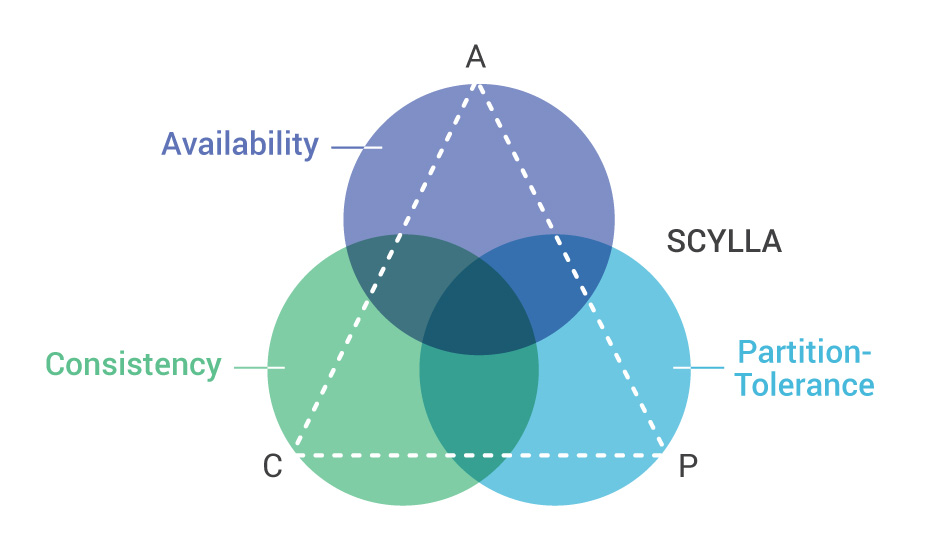

# Homework 0.

## 1. DragonFly.

Dragonfly is a simple, performant, and cost-efficient in-memory data store. Dragonfly is fully compatible with Redis APIs but without the Redis management complexity.

**That's why I think DragonFly aims to be CP**.

## 2. ScyllaDB.

ScyllaDB is a PA/EL highly available, partition tolerant, low latency database system. ScyllaDB was designed to provide consistent low-latencies, not just be highly available, and it also provides tunable consistency. Under any conditions short of a complete system failure, ScyllaDB will remain highly available with predictable low latencies for mission critical applications. 

[Source: ScyllaDB Documentation](https://www.scylladb.com/glossary/cap-theorem/)

**ScyllaDB chooses availability and partition tolerance** over consistency, such that:

 - It’s impossible to be both consistent and highly available during a network partition;

- If we sacrifice consistency, we can be highly available.

[Source: ScyllaDB Architecture](https://opensource.docs.scylladb.com/stable/architecture/architecture-fault-tolerance.html)

## 3. ArenadataDB.

Arenadata DB (ADB) – распределенная СУБД, использующая концепцию MPP (massively parallel processing, массивно-параллельные вычисления) и основанная на СУБД с открытым исходным кодом – Greenplum.

Аналитические массивно-параллельные СУБД предназначены для хранения и обработки больших объемов данных – от единиц до сотен терабайт данных. Такие СУБД чаще всего используются для предиктивной аналитики, регулярной отчетности, анализа оттока клиентов, построения корпоративных хранилищ данных.

В силу этого можно определить эту аналитическую СУБД как обладающую  **Availability and Partition tolerance**.

[Source: ArenadataDB Documentation](https://docs.arenadata.io/adb/index.html/)